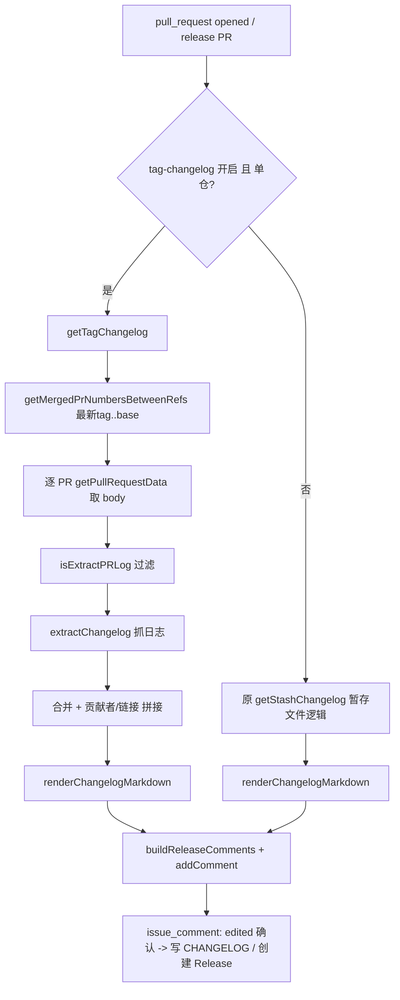

## 用户需求

为 FlowPilot 新增「基于 tag 的发布日志生成」能力,面向**单仓**场景,作为现有 mono repo 暂存式 changelog 的替代来源。

## 产品概述

在 release PR 打开时,不再(仅)依赖各 PR 写入的 `.changelog/*.md` 暂存文件,而是直接扫描「两个 tag 之间」已合并的 PR 列表,逐个读取其 PR body 中的 `### 📝 更新日志` 区块,合并且渲染为与现有流程一致的 `# 🎉 发布` / `# 🎉 Release` 确认评论。下游的评论确认、CHANGELOG 写入与 GitHub Release 创建逻辑完全复用。

## 核心特性

- 区间确定:默认 `from = 仓库最新 tag`、`to = base 分支 HEAD`;支持可选 `from-tag` / `to-tag` 输入覆盖。
- PR 列表获取:对区间内已合并 PR 去重,逐个抓取 body。
- 日志抓取与过滤:从 PR body 提取 `### 📝 更新日志`,复用现有跳过规则(Bot / `skip-changelog` 标签 / release 分支 / 勾选跳过)。
- 单仓合并渲染:忽略 PR body 中的 `#### package` 分包标题,将 `all` 与各包名日志合并为单一列表,按类型分组渲染。
- 产出一致:生成与现有 release PR 完全同构的确认评论与贡献者/PR 链接,下游无需改动。
- 作用边界:`tag-changelog` 开关开启且配置包数为 1(单仓)时启用;mono repo 或开关关闭时维持原暂存逻辑。

## 技术栈

- 沿用现有 GitHub Action 技术栈:TypeScript + `@actions/github`(octokit)+ `@actions/core`/`@actions/exec` + `marked` 解析 markdown,`tsdown` 构建,`vitest` 测试。
- 不引入新依赖;复用现有 `extractChangelog` / `renderChangelogMarkdown` / `isExtractPRLog` 与 `stashPackageChangelog` 的贡献者/链接拼接规则。

## 实现方案

### 总体策略

在 release PR `opened` 评论生成环节(`src/github-event/pull-request.ts` 第 65-90 行),以 `tag-changelog` 开关(且单仓)为条件,将 `getStashChangelog(release.dir, release.type)` 替换为新增的 `getTagChangelog(token, [pkgName], fromRef, toRef)`。新工具负责:扫描区间已合并 PR → 逐个取 body → 过滤 → 抓取 → 统一拼接贡献者/PR 链接 → `renderChangelogMarkdown` 渲染。版本号与评论标题仍来自 `getPullRequestReleaseDirs`(release PR diff),保持不变。

### 关键技术决策

1. **区间 PR 扫描方式**:采用 `octokit.rest.repos.compareCommitsWithBasehead({ base, head })` 取 head 相对 base 的 commits,筛选 merge commit,再对每个 merge commit 调 `repos.listPullRequestsAssociatedWithCommit` 取得 PR 编号并去重。理由:纯 API、无需额外 clone,与现有 `useGithub` 封装风格一致。

- 风险:`compareCommitsWithBasehead` 在超大区间存在约 250 commits 截断。缓解:对 release PR 路径(已 clone)增加 `git log <from>..<to> --merges --pretty=format:%s` 解析 `#(\d+)` 的回退分支;首版可先实现 API 方案并在日志中标注截断风险。

2. **最新 tag 获取**:`repos.listTags({ per_page: 1 })` 取首个 tag 名作为 `from`;该调用已是 octokit 标准方法,无需 clone。
3. **单仓日志合并**:`getTagChangelog` 以 `[pkgName]` 调 `extractChangelog`,同时收集 `all` 键与包名键下的条目,合并为统一列表;每条格式化为 `- ${log} @${login} ([#${pr}](${html_url}))`,沿用 `stashPackageChangelog` 的 `tdesign-bot`/Common PR 链接省略规则,保证与暂存文件产物格式一致,下游 `renderChangelogMarkdown` 零改动复用。
4. **开关与边界**:`getInput('tag-changelog') === 'true'` 且 `getConfiguredPackages(cwd()).length === 1` 才启用;否则走原 `getStashChangelog`,保证 mono repo 与未开启场景零回归。

### 性能与可靠性

- 区间内 PR 数量通常为数十级,逐 PR 调 `getPullRequestData` 为 O(n) 串行请求;首版串行即可,后续可批量/并发。需对 `getPullRequestData` 失败做单 PR 容错(记录日志并跳过),避免单个 PR 异常中断整体。
- 复用现有 `info` 日志与 `isExtractPRLog` 过滤,跳过条件与单 PR 路径完全一致。

## 实现注意事项

- 仅修改 release PR `opened` 分支,`closed`(发布)与 `issue_comment`(确认写 CHANGELOG)逻辑不动,blast radius 可控。
- 评论文本格式(`# 🎉 发布 <pkg>` / `# 🎉 Release <pkg>` + `## 🌈 version date`)必须与现有完全一致,`confirmReleaseLog` 才能解析。
- 新增 API 方法放入现有 `useGithub(token)` 返回对象,保持调用风格统一;不新增独立模块。
- 测试用 mock octokit(`@actions/github` 的 `getOctokit`),覆盖:区间内多 PR、跳过 Bot/skip 标签、合并 `all` 与包名日志、渲染分组正确。

## 架构设计



## 目录结构

```
action.yml                              # [MODIFY] 新增输入 tag-changelog(bool)、from-tag、to-tag
src/utils/github.ts                     # [MODIFY] useGithub 新增 listTags、getMergedPrNumbersBetweenRefs
src/utils/common.ts                     # [MODIFY] 新增 getTagChangelog,复用 extractChangelog/renderChangelogMarkdown/isExtractPRLog
src/github-event/pull-request.ts        # [MODIFY] release PR opened 分支按开关+单仓切换日志来源
README.md                               # [MODIFY] 新增「基于 tag 的发布日志(单仓)」小节、输入参数表、单仓 packages 可省略说明
test/utils/tag-changelog.test.ts        # [NEW] getTagChangelog 与 getMergedPrNumbersBetweenRefs 单测(mock octokit)
```

## 关键代码结构

```ts
// src/utils/github.ts —— 新增于 useGithub(token) 返回对象
async function listTags(): Promise<string> // 返回仓库最新 tag 名(repos.listTags per_page=1)
async function getMergedPrNumbersBetweenRefs(base: string, head: string): Promise<number[]>
```

```ts
// src/utils/common.ts —— 新增导出
export async function getTagChangelog(
  token: string,
  pkgNames: string[],
  fromRef: string,
  toRef: string,
): Promise<string> // 返回渲染后的 release changelog markdown
```